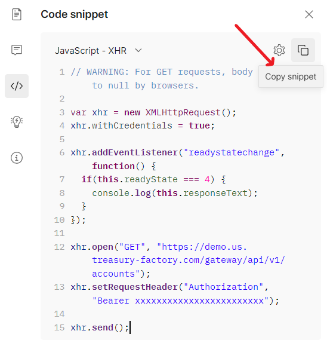

# dev-portal-basic-JavaScript-Postman-App

## Requirements

Building the client library requires:

1. Node.js - [Installation](https://nodejs.org/en/download/)

> :warning: *Make sure that there is also added a variable to the PATH: [Node.js - Environment Setup](https://www.tutorialspoint.com/nodejs/nodejs_environment_setup.htm).*

## Installation

To copy the client to your computer copy link of the repository, open Command Prompt, go to the location where project will be copied and execute git clone command:

```git
git clone https://github.com/kyriba/dev-portal-basic-JavaScript-Postman-App-sample.git
```

Open the project folder via command prompt, for example:

```cmd
cd dev-portal-basic-JavaScript-Postman-App
```

Select the desired Collection in Postman, authenticate through "Get token." request and run the request that you want to provide in the Application. If the request works, copy code from Postman:


In "Code snippet", proceed to the dropdown list with different programming languages, where "cURL" is set by default, and choose "JavaScript - XHR" from the list. There, copy the snippet to clipboard:



Open the .../App.js file with any text redactor and input your piece of code:


Replace this line of code:


with this one:

```cmd
console.log(JSON.stringify(JSON.parse(this.responseText), null, 2));
```

Run the project in Terminal in the root folder of cloned app:

```cmd
node App.js
```

If everything was done accordingly with provided steps, you will get the result printed in the command prompt.
